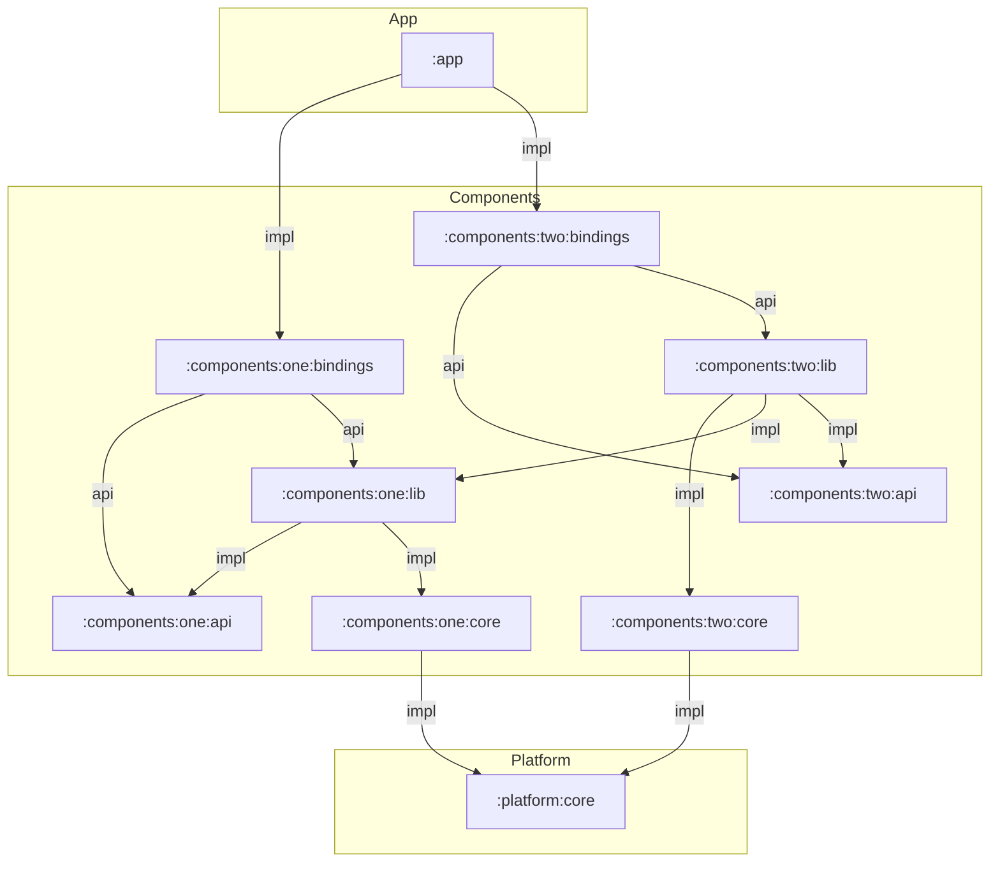

# Architecture Proposal for Android Modules

This project is a proposal for android modules. The goals are multiple:

- leverage gradle compilation avoidance as much as possible and especially try to avoid compiling "lib" when not necessary
- avoid creating too many modules (gradle configuration time)
- expose only what's necessary in `api` modules, never anything internal

This project is useful to see which task is re-executed when a given module changes. See the "Results" sections below.

## Disclaimer about DI

Dependency injection is done by hand in this project, but should work in a similar way using Hilt.

## Modules dependency graph



## Checking for Gradle execution

Executed tasks are verified using the `./gradlew assemble` command. To quickly see which tasks were re-executed, run:

```
./gradlew assemble --console=plain | grep -E --invert-match "(UP-TO-DATE|NO-SOURCE|SKIPPED) | sort"
```

## Results

1) After renaming `Core::getItemTwo` to `Core::getItemTwoUpdated`

|                           | assemble  | bundle         | compile    | lint   |
|---------------------------|-----------|----------------|------------|--------|
| :app                      | x         |                | x          | x      |
| :component:.one:api       |           |                |            |        |
| :component:.one:bindings  |           |                | x          | x      |
| :component:.one:core      |           |                |            |        |
| :component:.one:lib       |           |                |            | x      |
| :component:.two:api       |           |                |            |        |
| :component:.two:bindings  |           |                | x          | x      |
| :component:.two:core      | x         | x              | x          | x      |
| :component:.two:lib       |           |                |            | x      |
| :platform:core            | x         | x              | x          | x      |

All re-run tasks (sorted, without lint):

```
> Task :app:assemble
> Task :app:assembleDebug
> Task :app:assembleRelease
> Task :app:compileDebugKotlin
> Task :app:compileReleaseArtProfile
> Task :app:compileReleaseKotlin
> Task :app:mergeDexRelease
> Task :app:mergeLibDexDebug
> Task :app:packageDebug
> Task :app:packageRelease

> Task :component:one:bindings:compileDebugKotlin
> Task :component:one:bindings:compileReleaseKotlin
> Task :component:one:bindings:extractDebugAnnotations
> Task :component:one:bindings:extractReleaseAnnotations

> Task :component:one:core:compileDebugKotlin
> Task :component:one:core:compileReleaseKotlin
> Task :component:one:core:extractDebugAnnotations
> Task :component:one:core:extractReleaseAnnotations

> Task :component:two:bindings:compileDebugKotlin
> Task :component:two:bindings:compileReleaseKotlin
> Task :component:two:bindings:extractDebugAnnotations
> Task :component:two:bindings:extractReleaseAnnotations

> Task :component:two:core:assemble
> Task :component:two:core:assembleDebug
> Task :component:two:core:assembleRelease
> Task :component:two:core:bundleDebugAar
> Task :component:two:core:bundleLibCompileToJarDebug
> Task :component:two:core:bundleLibCompileToJarRelease
> Task :component:two:core:bundleLibRuntimeToDirDebug
> Task :component:two:core:bundleLibRuntimeToDirRelease
> Task :component:two:core:bundleLibRuntimeToJarDebug
> Task :component:two:core:bundleLibRuntimeToJarRelease
> Task :component:two:core:bundleReleaseAar
> Task :component:two:core:compileDebugKotlin
> Task :component:two:core:compileReleaseKotlin
> Task :component:two:core:createFullJarRelease
> Task :component:two:core:extractDebugAnnotations
> Task :component:two:core:extractReleaseAnnotations
> Task :component:two:core:syncDebugLibJars
> Task :component:two:core:syncReleaseLibJars

> Task :platform:core:assemble
> Task :platform:core:assembleDebug
> Task :platform:core:assembleRelease
> Task :platform:core:bundleDebugAar
> Task :platform:core:bundleLibCompileToJarDebug
> Task :platform:core:bundleLibCompileToJarRelease
> Task :platform:core:bundleLibRuntimeToDirDebug
> Task :platform:core:bundleLibRuntimeToDirRelease
> Task :platform:core:bundleLibRuntimeToJarDebug
> Task :platform:core:bundleLibRuntimeToJarRelease
> Task :platform:core:bundleReleaseAar
> Task :platform:core:compileDebugKotlin
> Task :platform:core:compileReleaseKotlin
> Task :platform:core:createFullJarRelease
> Task :platform:core:extractDebugAnnotations
> Task :platform:core:extractReleaseAnnotations
> Task :platform:core:syncDebugLibJars
> Task :platform:core:syncReleaseLibJars
```

2) After renaming `Core::getItemOne` to `Core::getItemOneUpdated`: (RepositoryOne is use in RepositoryTwo)

|                           | assemble  | bundle         | compile    | lint   |
|---------------------------|-----------|----------------|------------|--------|
| :app                      | x         |                | x          | x      |
| :component:.one:api       |           |                |            |        |
| :component:.one:bindings  |           |                | x          | x      |
| :component:.one:core      | x         | x              | x          | x      |
| :component:.one:lib       |           |                |            | x      |
| :component:.two:api       |           |                |            |        |
| :component:.two:bindings  |           |                | x          | x      |
| :component:.two:core      |           |                | x          | x      |
| :component:.two:lib       |           |                |            | x      |
| :platform:core            | x         | x              | x          | x      |

Note that in both cases, the `lib` for components `one` and `two` were not neither assembled, bundled or compiled !
Only `core` and `bindings` modules were affected (as well as `app`, of course).

All re-run tasks (sorted, without lint):

```
> Task :app:assemble
> Task :app:assembleDebug
> Task :app:assembleRelease
> Task :app:compileDebugKotlin
> Task :app:compileReleaseArtProfile
> Task :app:compileReleaseKotlin
> Task :app:mergeDexRelease
> Task :app:mergeLibDexDebug
> Task :app:packageDebug
> Task :app:packageRelease

> Task :component:one:bindings:compileDebugKotlin
> Task :component:one:bindings:compileReleaseKotlin
> Task :component:one:bindings:extractDebugAnnotations
> Task :component:one:bindings:extractReleaseAnnotations

> Task :component:one:core:assemble
> Task :component:one:core:assembleDebug
> Task :component:one:core:assembleRelease
> Task :component:one:core:bundleDebugAar
> Task :component:one:core:bundleLibCompileToJarDebug
> Task :component:one:core:bundleLibCompileToJarRelease
> Task :component:one:core:bundleLibRuntimeToDirDebug
> Task :component:one:core:bundleLibRuntimeToDirRelease
> Task :component:one:core:bundleLibRuntimeToJarDebug
> Task :component:one:core:bundleLibRuntimeToJarRelease
> Task :component:one:core:bundleReleaseAar
> Task :component:one:core:compileDebugKotlin
> Task :component:one:core:compileReleaseKotlin
> Task :component:one:core:createFullJarRelease
> Task :component:one:core:extractDebugAnnotations
> Task :component:one:core:extractReleaseAnnotations
> Task :component:one:core:syncDebugLibJars
> Task :component:one:core:syncReleaseLibJars

> Task :component:two:bindings:compileDebugKotlin
> Task :component:two:bindings:compileReleaseKotlin
> Task :component:two:bindings:extractDebugAnnotations
> Task :component:two:bindings:extractReleaseAnnotations

> Task :component:two:core:compileDebugKotlin
> Task :component:two:core:compileReleaseKotlin
> Task :component:two:core:extractDebugAnnotations
> Task :component:two:core:extractReleaseAnnotations

> Task :platform:core:assemble
> Task :platform:core:assembleDebug
> Task :platform:core:assembleRelease
> Task :platform:core:bundleDebugAar
> Task :platform:core:bundleLibCompileToJarDebug
> Task :platform:core:bundleLibCompileToJarRelease
> Task :platform:core:bundleLibRuntimeToDirDebug
> Task :platform:core:bundleLibRuntimeToDirRelease
> Task :platform:core:bundleLibRuntimeToJarDebug
> Task :platform:core:bundleLibRuntimeToJarRelease
> Task :platform:core:bundleReleaseAar
> Task :platform:core:compileDebugKotlin
> Task :platform:core:compileReleaseKotlin
> Task :platform:core:createFullJarRelease
> Task :platform:core:extractDebugAnnotations
> Task :platform:core:extractReleaseAnnotations
> Task :platform:core:syncDebugLibJars
> Task :platform:core:syncReleaseLibJars
```

## Conclusion

With this architecture, even when the Core's api surface changes, only the core & bindings  
